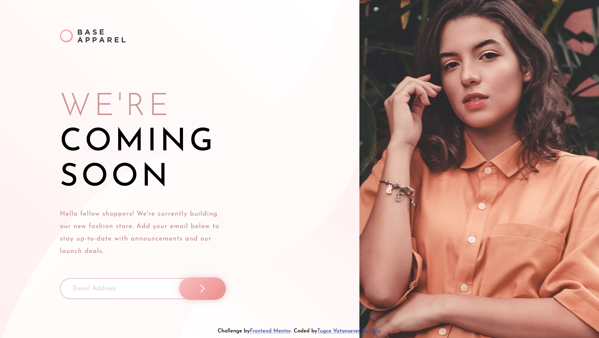

# Frontend Mentor - Base Apparel coming soon page solution

This is a solution to the [Base Apparel coming soon page challenge on Frontend Mentor](https://www.frontendmentor.io/challenges/base-apparel-coming-soon-page-5d46b47f8db8a7063f9331a0). Frontend Mentor challenges help you improve your coding skills by building realistic projects.

## Table of contents

- [Overview](#overview)
  - [The challenge](#the-challenge)
  - [Screenshot](#screenshot)
  - [Links](#links)
- [My process](#my-process)
  - [Built with](#built-with)
  - [What I learned](#what-i-learned)
  - [Continued development](#continued-development)
- [Author](#author)

## Overview

### The challenge

Users should be able to:

- View the optimal layout for the site depending on their device's screen size
- See hover states for all interactive elements on the page
- Receive an error message when the `form` is submitted if:
  - The `input` field is empty
  - The email address is not formatted correctly

### Screenshot

### Links

- Solution URL: [My solution URL here](https://github.com/TugceVG/frontend-mentor-challenges/tree/main/coming-soon-page)
- Live Site URL: [Add live site URL here](https://coming-soon-page-tugcevg.netlify.app/)

## My process

### Built with

- Semantic HTML5 markup
- CSS custom properties
- CSS Flex
- Mobile-first workflow
- Vanilla JS

### What I learned

I would like to recap some of the key learnings from this project, which include:

- Using CSS flex to organize related elements on a webpage.
- Understanding how to effectively use CSS variables with HSL colors.
- How to add form validation on HTML with JavaScript.
- Implementing media queries for responsive design in the project.

### Continued development

Recently, I have been studying HTML, CSS, JavaScript, and ReactJS. I am currently taking a ReactJS course on Udemy. Generally, ReactJS courses assume some prior knowledge of HTML and CSS. Therefore, I have been refreshing my knowledge of them and learning new features. I believe that applying this new knowledge in creating projects will help me grasp new features more easily. So, I think it's a brilliant idea to tackle new challenges on Frontend Mentor. My plan is to solve and share one challenge per week.

Next challenge will be [FAQ accordion](https://www.frontendmentor.io/challenges/faq-accordion-wyfFdeBwBz).

## Author

- Website - [Tugce Vatansever Gunduz](https://tugcevatansevergunduz.com/)
- Frontend Mentor - [@TugceVG](https://www.frontendmentor.io/profile/TugceVG)
- Github - [Tugce Vatansever Gunduz](https://github.com/TugceVG)
