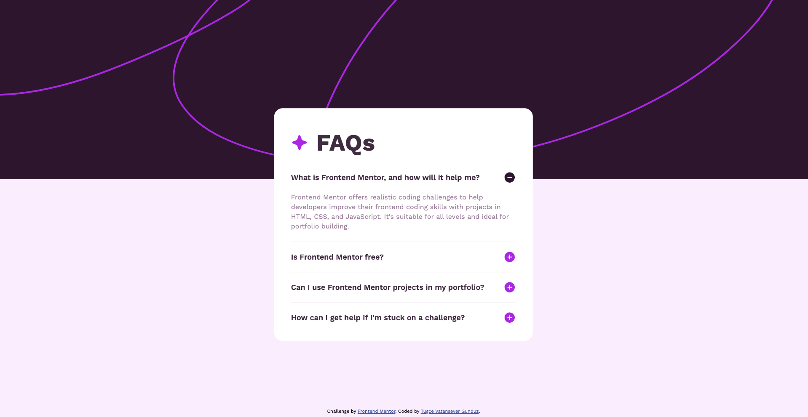

# Frontend Mentor - FAQ accordion

This is a solution to the [FAQ accordion challenge on Frontend Mentor](https://www.frontendmentor.io/challenges/faq-accordion-wyfFdeBwBz). Frontend Mentor challenges help you improve your coding skills by building realistic projects.

## Table of contents

- [Overview](#overview)
  - [The challenge](#the-challenge)
  - [Screenshot](#screenshot)
  - [Links](#links)
- [My process](#my-process)
  - [Built with](#built-with)
  - [What I learned](#what-i-learned)
  - [Continued development](#continued-development)
- [Author](#author)

## Overview

### The challenge

Users should be able to:

- Hide/Show the answer to a question when the question is clicked
- Navigate the questions and hide/show answers using keyboard navigation alone
- View the optimal layout for the interface depending on their device's screen size
- See hover and focus states for all interactive elements on the page

### Screenshot

### Links

- Solution URL: [My solution URL here](https://github.com/TugceVG/frontend-mentor-challenges/tree/main/faq-accordion-main)
- Live Site URL: [Live site URL here](https://faq-accordion-tugcevg.netlify.app/)

## My process

### Built with

- Semantic HTML5 markup
- CSS custom properties
- CSS Flex
- Mobile-first workflow
- Vanilla JS

### What I learned

I would like to recap some of the key learnings from this project, which include:

- Utilizing CSS flexbox to arrange related elements on a webpage.
- Understanding the effective utilization of CSS variables with HSL colors.
- Adding and adjusting a background photo on an HTML page using CSS.
- Implementing media queries for responsive design within the project.

### Continued development

Lately, I've been working with HTML, CSS, JavaScript, and ReactJS on some freelance projects. I'm also taking a ReactJS course on Udemy. ReactJS courses usually expect some knowledge of HTML and CSS beforehand, so I'm refreshing my memory on those and learning new things. I think it's a great idea to practice by taking on challenges on Frontend Mentor. My plan is to solve and share one challenge each week.

Next challenge will be [E-commerce product page](https://www.frontendmentor.io/challenges/ecommerce-product-page-UPsZ9MJp6).

## Author

- Website - [Tugce Vatansever Gunduz](https://tugcevatansevergunduz.com/)
- Frontend Mentor - [@TugceVG](https://www.frontendmentor.io/profile/TugceVG)
- Github - [Tugce Vatansever Gunduz](https://github.com/TugceVG)
