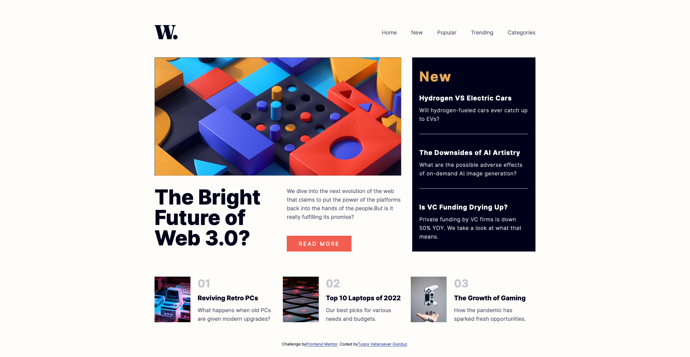

# Frontend Mentor - News homepage solution

This is a solution to the [News homepage challenge on Frontend Mentor](https://www.frontendmentor.io/challenges/news-homepage-H6SWTa1MFl). Frontend Mentor challenges help you improve your coding skills by building realistic projects.

## Table of contents

- [Overview](#overview)
  - [The challenge](#the-challenge)
  - [Screenshot](#screenshot)
  - [Links](#links)
- [My process](#my-process)
  - [Built with](#built-with)
  - [What I learned](#what-i-learned)
  - [Continued development](#continued-development)
- [Author](#author)
- [Acknowledgments](#acknowledgments)

## Overview

### The challenge

Users should be able to:

- View the optimal layout for the site depending on their device's screen size

### Screenshot

### Links

- Solution URL: [My solution URL here](https://github.com/TugceVG/frontend-mentor-challenges/tree/main/news-homepage)
- Live Site URL: [Live site URL here](https://news-homepage-tugcevg.netlify.app/)

## My process

### Built with

- Semantic HTML5 markup
- CSS custom properties
- CSS flex
- Mobile-first workflow

### What I learned

I would like to recap some of the key learnings from this project, which include:

- Using CSS flex to organize related elements on a webpage.
- Understanding what backdrop are and how to effectively use it in a file.
- Creating a hamburger menu.
- Implementing media queries for responsive design in the project.
- Using javascript to add some functionality to the nav menu to cover it with hamburger menu feature.

### Continued development

Recently, I have been studying HTML, CSS, JavaScript, and ReactJS. I am currently taking a ReactJS course on Udemy. Generally, ReactJS courses assume some prior knowledge of HTML and CSS. Therefore, I have been refreshing my knowledge of them and learning new features. I believe that applying this new knowledge in creating projects will help me grasp new features more easily. So, I think it's a brilliant idea to tackle new challenges on Frontend Mentor. My plan is to solve and share one challenge per week.

Next challenge will be [Results summary component](https://www.frontendmentor.io/challenges/results-summary-component-CE_K6s0maV/hub).

## Author

- Website - [Tugce Vatansever Gunduz](https://tugcevatansevergunduz.com/)
- Frontend Mentor - [@TugceVG](https://www.frontendmentor.io/profile/TugceVG)
- Github - [Tugce Vatansever Gunduz](https://github.com/TugceVG)

## Acknowledgments

I have been taking a course from Udemy and it is called [Sıfırdan Projelerle Front-End ve React 18.x Öğren (52+Saat)](https://www.udemy.com/course/sifirdan-projelerle-javascript-ve-react-ogren). The course is presented by Hakan Yalcinkaya and is useful for learning the fundamentals of becoming a frontend developer. My primary goal is to gain more knowledge about ReactJS. However, it will be beneficial to refresh my understanding of HTML, CSS, and JavaScript by following this course.
