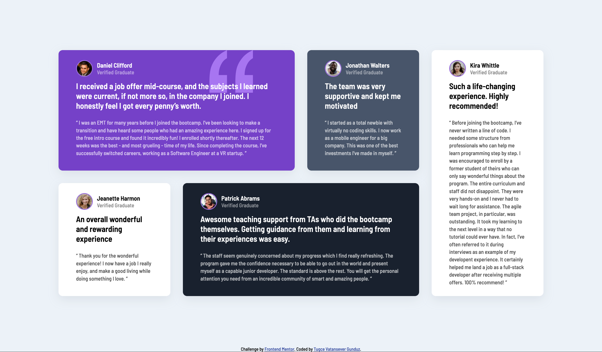

# Frontend Mentor - Testimonials grid section solution

This is a solution to the [Testimonials grid section challenge on Frontend Mentor](https://www.frontendmentor.io/challenges/testimonials-grid-section-Nnw6J7Un7). Frontend Mentor challenges are an excellent way to improve your coding skills by building realistic projects.

## Table of contents

- [Overview](#overview)
  - [The challenge](#the-challenge)
  - [Screenshot](#screenshot)
  - [Links](#links)
- [My process](#my-process)
  - [Built with](#built-with)
  - [What I learned](#what-i-learned)
  - [Continued development](#continued-development)
  - [Useful resources](#useful-resources)
- [Author](#author)

## Overview

### The challenge

Users should be able to:

- View the optimal layout for the site depending on their device's screen size

### Screenshot



### Links

- Solution URL: [My solution URL here](https://github.com/TugceVG/frontend-mentor-challenges/tree/main/testimonials-grid-section-main)
- Live Site URL: [Live site URL here](https://testimonials-grid-section-tugcevg.netlify.app/)

## My process

### Built with

- Semantic HTML5 markup
- CSS custom properties
- CSS Grid
- Mobile-first workflow

### What I learned

I would like to recap over some of my learning while through this project. 

- How to use CSS grid to arrange related elements on my page.
- Using structural pseudo-class selector in CSS. 
- What the markdown is and how to use markdown file effectively.

```css
.grid-container {
  /* Firstly, we need to identify a parent element and set its display property value to 'grid' in order to arrange our elements.*/
  display: grid; 
  /* Next, I divided my parent element into four sections and assigned each section the similar area.*/
  grid-template-columns: repeat(4,1fr);
}

/* This is the example of using structural pseudo-class selector in CSS file. This selects the first element with the class .card among its siblings.*/
.card:nth-of-type(1) {
  /* This places the selected element from grid column 1 to column 3. So, it will span two columns.*/
  grid-column: 1/3;
}

/* Then, I applied the same action to the other elements that I wanted to arrange using this method.*/
```
- What the semantic HTML Elements are and their roles on out website.
```html
Some of Semantic HTML Elements
<main></main>
<header></header>
<nav></nav>
<section></section>
<article></article>
<aside></aside>
<footer></footer>
```
- Adding media query on the project to arrange the responsive design.
```css
/* This is a media query. It applies the styles within the media query block only when the screen width is 768 pixels or less*/
@media(max-width: 768px) {
  .grid-container {
    grid-template-columns: 1fr;
  }
}  
```
- Adding .svg file on project by CSS.
```css
/* This is a class selector. It applies the .svg document within a CSS property.*/
.violet {
  background-image: url("images/bg-pattern-quotation.svg");
  background-repeat: no-repeat;
  background-position: top 0px right 100px ;
}
```

### Continued development

Recently, I have been studying HTML, CSS, JavaScript, and ReactJS. I am currently taking a ReactJS course on Udemy. Generally, ReactJS courses assume some prior knowledge of HTML and CSS. Therefore, I have been refreshing my knowledge of them and learning new features. I believe that applying this new knowledge in creating projects will help me grasp new features more easily. So, I think it's a brilliant idea to tackle new challenges on Frontend Mentor. My plan is to solve and share one challenge per week.

Next challenge will be Fylo data storage component.

### Useful resources

- [freeCodeCamp](https://www.freecodecamp.org/news/how-to-use-css-grid-layout/) - This is an easily understandable article which helped me CSS grid design. I'd recommend it everyone who is beginer learning this concept.
- [CSS Tricks](https://css-tricks.com/snippets/css/complete-guide-grid/) - This is an amazing article that helped me understand CSS grid design deeply. I'd recommend it to anyone still learning this concept.


## Author

- Website - [Tugce Vatansever Gunduz](https://tugcevatansevergunduz.com/)
- Frontend Mentor - [@TugceVG](https://www.frontendmentor.io/profile/TugceVG)
- Github - [Tugce Vatansever Gunduz](https://github.com/TugceVG)
